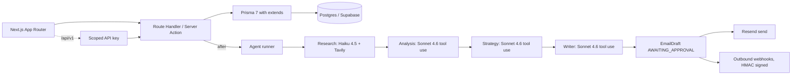

# Sonar

AI sales enablement workspace. A rep uploads a sales call recording, and the app returns research about the prospect's company, an analysis of the call, a recommended next step, and a follow-up email draft. The email includes citations that link phrases back to specific moments in the transcript.

Portfolio project. The codebase exercises multi-agent orchestration with state, production audio processing, and multi-tenant B2B architecture.

- Live demo: TODO
- API docs: `/docs` on the live deployment
- Loom walkthrough: TODO

## What it does

A sales rep uploads a call recording. Roughly twenty seconds later the app returns:

1. Research on the prospect's company. Uses Tavily web search and Claude Haiku 4.5.
2. Structured analysis of the call: topics, pain points, objections, action items, sentiment. Uses Claude Sonnet 4.6.
3. Recommended next step, talking points, urgency. Uses Claude Sonnet 4.6.
4. Follow-up email draft with citations. Uses Claude Sonnet 4.6.

The reviewer sees a split view with the email on the left and the transcript on the right. Hovering a citation highlights the matching transcript segment. The reviewer can approve, edit the body in place, or regenerate the writer node with feedback. Regeneration reuses the prior research, analysis, and strategy state; only the writer runs again.

## Pillars

### Multi-agent orchestration

- Four sequential nodes: research, transcription, analysis, strategy, writer.
- Every node returns structured output through Anthropic tool use plus a Zod schema. No free-text outputs.
- Each step writes an `AgentRunStep` row. The run pauses at `AWAITING_APPROVAL` after the writer step so a human can review.
- Anthropic prompt caching is enabled on system messages. On repeat runs against the same workspace this cuts input tokens by roughly 70%.
- The writer step can be regenerated with reviewer feedback without re-running the upstream nodes.
- Background execution uses Next.js 16's `after()` route handler with `maxDuration = 300`.

### Audio processing

- Drag-drop upload goes from the browser to Supabase Storage via a signed upload URL. The server is not in the upload path.
- Groq Whisper Large v3 transcribes the audio with segment-level timestamps.
- MIME type and a 100 MB size cap are enforced both on the server action and the bucket policy.
- The writer node receives transcript segments tagged with bracketed indices. Citations reference those indices so the reviewer can verify each claim.
- The split-view UI scrolls the cited segment into view when the reviewer hovers a citation.

### Multi-tenant B2B

Three layers of tenant isolation:

| Layer                                | Mechanism                                              | File                   |
| ------------------------------------ | ------------------------------------------------------ | ---------------------- |
| Branded TypeScript IDs at call sites | `OrgId`, `UserId`, `LeadId`, etc.                      | `lib/db/types.ts`      |
| Prisma `$extends` middleware         | `getDb(orgId)` auto-injects `orgId` on every operation | `lib/db/with-org.ts`   |
| Postgres RLS                         | `is_member_of(org_id)` policy on every tenant table    | `prisma/sql/setup.sql` |

Plus the rest of the B2B surface:

- Workspace switcher and invite-by-link onboarding.
- Stripe billing (Checkout, Customer Portal, idempotent webhook handler).
- Outbound webhooks with HMAC-SHA256 signing, a 5-minute timestamp tolerance window, delivery log, and manual replay.
- Scoped API keys (5 scopes, last-used tracking, revocable) protecting the `/api/v1/*` endpoints.
- Audit log written on every mutating action, filterable by category in the UI.
- Soft delete with a `/trash` restore page.

## Stack

Next.js 16, TypeScript strict, Tailwind v4, shadcn/ui, Prisma 7 (adapter pattern), Supabase (Auth + Postgres pgvector + Storage), Claude Sonnet 4.6 and Haiku 4.5, Groq Whisper, Tavily, Stripe, Resend, Sentry, PostHog, Vitest, Geist Sans and Mono, violet accent.

## Performance targets

The numbers below are what the architecture is designed for. They will be measured against the live deployment once services are wired up.

- Agent run end-to-end on a 5-minute call: 15 to 25 seconds with prompt caching warmed.
- First structured output (research step): under 1.5 seconds p50.
- Transcription: about 10 seconds per 30 minutes of audio (Groq Whisper Large v3).
- Cross-tenant access probes: blocked at the branded-types layer, verified at the Prisma `$extends` layer, verified again at the Postgres RLS layer.

## Architecture



## Local development

Requires Node 22 (see `.nvmrc`) and Yarn 4 via Corepack. Enable Corepack once with `corepack enable`; it picks the Yarn version pinned in `package.json#packageManager`.

```bash
cp .env.example .env.local
# Fill in: Supabase URL + anon key + service role key + database URLs,
# Anthropic, Groq, Tavily, Stripe (test mode), Resend.
# Optional: Sentry, PostHog, LangSmith.

nvm use                                       # picks 22 from .nvmrc
corepack enable                               # one-time, lets yarn 4 self-install
yarn install                                  # postinstall runs prisma generate
yarn prisma migrate dev --name init
psql "$DIRECT_URL" -f prisma/sql/setup.sql    # or paste into the Supabase SQL editor
yarn prisma db seed
yarn dev
```

Scripts:

```bash
yarn typecheck   # tsc --noEmit
yarn lint        # ESLint flat config
yarn test        # Vitest
yarn build       # Next.js production build
```

## Project layout

```
app/
  (marketing)/    home page
  (auth)/         login, signup, oauth callback
  (onboarding)/   create-org, accept-invite
  (app)/          authenticated shell
    leads/        kanban, lead detail, call detail, agent run
    runs/[id]/    agent run viewer (live polling)
    emails/[id]/  approval split view with citations
    settings/     members, billing, api-keys, webhooks, audit-log
    trash/        soft-deleted recovery
  api/
    v1/           public REST API (scoped via API keys)
    webhooks/     stripe (idempotent), resend
    runs/start/   authenticated UI entrypoint
  docs/           public docs site

lib/
  agents/         graph, prompts, four nodes, runner, state
  db/             types (branded), client (lazy adapter), with-org
  auth/           session, sign-in / sign-out actions, org switching
  audit/          writeAudit
  api-keys/       crypto, verify middleware, actions
  webhooks/       hmac, publish + deliver + replay, events catalog
  email/          Resend wrapper, actions (approve, edit, regenerate)
  storage/        Supabase Storage helpers
  billing/        Stripe wrapper, checkout and portal actions
  observability/  PostHog provider

prisma/
  schema.prisma   18 models
  sql/setup.sql   pgvector, auth trigger, RLS policies, storage bucket
  seed.ts         demo workspace with 10 leads and a sample call
```

## CI

Runs on every PR and on push to main. Pipeline order:

1. `tsc --noEmit`
2. ESLint flat config
3. Vitest
4. `next build`

Status badges land here once GitHub Actions has its first green run.

## License

MIT. See [LICENSE](LICENSE).
