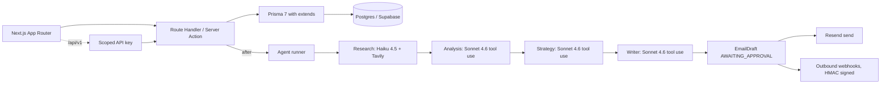

# Sonar

AI sales enablement workspace. A rep uploads a sales call recording, and the app returns research about the prospect's company, an analysis of the call, a recommended next step, and a follow-up email draft. The email includes citations that link phrases back to specific moments in the transcript.

Portfolio project. The codebase exercises multi-agent orchestration with state, production audio processing, and multi-tenant B2B architecture.

- Live demo: TODO
- API docs: `/docs` on the live deployment
- Loom walkthrough: TODO

## What it does

A sales rep uploads a call recording. Roughly twenty seconds later the app returns:

1. Research on the prospect's company. Uses Tavily web search and Claude Haiku 4.5.
2. Structured analysis of the call: topics, pain points, objections, action items, sentiment. Uses Claude Sonnet 4.6.
3. Recommended next step, talking points, urgency. Uses Claude Sonnet 4.6.
4. Follow-up email draft with citations. Uses Claude Sonnet 4.6.

The reviewer sees a split view with the email on the left and the transcript on the right. Hovering a citation highlights the matching transcript segment. The reviewer can approve, edit the body in place, or regenerate the writer node with feedback. Regeneration reuses the prior research, analysis, and strategy state; only the writer runs again.

## Pillars

### Multi-agent orchestration

- Four sequential nodes: research, transcription, analysis, strategy, writer.
- Every node returns structured output through Anthropic tool use plus a Zod schema. No free-text outputs.
- Each step writes an `AgentRunStep` row. The run pauses at `AWAITING_APPROVAL` after the writer step so a human can review.
- Anthropic prompt caching is enabled on system messages. On repeat runs against the same workspace this cuts input tokens by roughly 70%.
- The writer step can be regenerated with reviewer feedback without re-running the upstream nodes.
- Background execution uses Next.js 16's `after()` route handler. The route's `maxDuration` is `60` to fit Vercel Hobby; bump it to `300` here and in the Vercel project settings on Pro.

### Audio processing

- Drag-drop upload goes from the browser to Supabase Storage via a signed upload URL. The server is not in the upload path.
- Groq Whisper Large v3 transcribes the audio with segment-level timestamps.
- MIME type and a 100 MB size cap are enforced both on the server action and the bucket policy.
- The writer node receives transcript segments tagged with bracketed indices. Citations reference those indices so the reviewer can verify each claim.
- The split-view UI scrolls the cited segment into view when the reviewer hovers a citation.

### Multi-tenant B2B

Three layers of tenant isolation:

| Layer                                | Mechanism                                              | File                   |
| ------------------------------------ | ------------------------------------------------------ | ---------------------- |
| Branded TypeScript IDs at call sites | `OrgId`, `UserId`, `LeadId`, etc.                      | `lib/db/types.ts`      |
| Prisma `$extends` middleware         | `getDb(orgId)` auto-injects `orgId` on every operation | `lib/db/with-org.ts`   |
| Postgres RLS                         | `is_member_of(org_id)` policy on every tenant table    | `prisma/sql/setup.sql` |

Plus the rest of the B2B surface:

- Workspace switcher and invite-by-link onboarding.
- Stripe billing (Checkout, Customer Portal, idempotent webhook handler).
- Outbound webhooks with HMAC-SHA256 signing, a 5-minute timestamp tolerance window, delivery log, and manual replay.
- Scoped API keys (4 scopes, last-used tracking, revocable) protecting the `/api/v1/*` endpoints.
- Audit log written on every mutating action, filterable by category in the UI.
- Soft delete with a `/trash` restore page.

## Stack

Next.js 16, TypeScript strict, Tailwind v4, shadcn/ui, Prisma 7 (adapter pattern), Supabase (Auth + Postgres pgvector + Storage), Claude Sonnet 4.6 and Haiku 4.5, Groq Whisper, Tavily, Stripe, Resend, Sentry, PostHog, Vitest, Geist Sans and Mono, violet accent.

## Performance targets

The numbers below are what the architecture is designed for. They will be measured against the live deployment once services are wired up.

- Agent run end-to-end on a 5-minute call: 15 to 25 seconds with prompt caching warmed.
- First structured output (research step): under 1.5 seconds p50.
- Transcription: about 10 seconds per 30 minutes of audio (Groq Whisper Large v3).
- Cross-tenant access probes: blocked at the branded-types layer, verified at the Prisma `$extends` layer, verified again at the Postgres RLS layer.

## Architecture



## Environment variables

Sonar reads env vars via Next.js (`.env.local` for development, the platform's secret store for production). Same variable names in both. The "Sensitive" column tracks whether the value should be marked secret in your hosting provider (Vercel calls this "Sensitive"; the lock icon next to the input). `NEXT_PUBLIC_*` values end up in the client bundle anyway, so marking them sensitive only hides them in the UI; they aren't actually private.

| Variable                                                         | Production                                                                        | Local (`.env.local`)                                                                                                     | Sensitive |
| ---------------------------------------------------------------- | --------------------------------------------------------------------------------- | ------------------------------------------------------------------------------------------------------------------------ | --------- |
| `NEXT_PUBLIC_APP_URL`                                            | the public origin of your deployment, e.g. `https://<your-deployment>.vercel.app` | `http://localhost:3000`                                                                                                  | no        |
| `NEXT_PUBLIC_SUPABASE_URL`                                       | `https://<project>.supabase.co`                                                   | same                                                                                                                     | no        |
| `NEXT_PUBLIC_SUPABASE_ANON_KEY`                                  | publishable key, `sb_publishable_xxx`                                             | same                                                                                                                     | no        |
| `SUPABASE_SERVICE_ROLE_KEY`                                      | secret key, `sb_secret_xxx`                                                       | same                                                                                                                     | yes       |
| `DATABASE_URL`                                                   | Supabase **transaction pooler** URI + `?pgbouncer=true&connection_limit=1`        | Supabase **session pooler** URI                                                                                          | yes       |
| `DIRECT_URL`                                                     | Supabase **session pooler** URI                                                   | same                                                                                                                     | yes       |
| `ANTHROPIC_API_KEY`                                              | from `console.anthropic.com`                                                      | same                                                                                                                     | yes       |
| `GROQ_API_KEY`                                                   | from `console.groq.com`                                                           | same                                                                                                                     | yes       |
| `TAVILY_API_KEY`                                                 | from `tavily.com`                                                                 | same                                                                                                                     | yes       |
| `STRIPE_SECRET_KEY`                                              | test mode `sk_test_xxx`                                                           | same                                                                                                                     | yes       |
| `NEXT_PUBLIC_STRIPE_PUBLISHABLE_KEY`                             | test mode `pk_test_xxx`                                                           | same                                                                                                                     | no        |
| `STRIPE_WEBHOOK_SECRET`                                          | `whsec_xxx` from the production webhook endpoint you create in Stripe             | `whsec_xxx` printed by `stripe listen --forward-to localhost:3000/api/webhooks/stripe` (different value from production) | yes       |
| `STRIPE_PRICE_PRO`                                               | `price_xxx` of your Pro recurring price                                           | same                                                                                                                     | no        |
| `RESEND_API_KEY`                                                 | sending-access key                                                                | same                                                                                                                     | yes       |
| `RESEND_FROM_EMAIL`                                              | `onboarding@resend.dev` until you verify a domain                                 | same                                                                                                                     | no        |
| `SENTRY_DSN` _(optional)_                                        | from a Sentry project                                                             | same or unset                                                                                                            | yes       |
| `NEXT_PUBLIC_SENTRY_DSN` _(optional)_                            | same value as above                                                               | same or unset                                                                                                            | no        |
| `SENTRY_AUTH_TOKEN` _(optional, for source map upload at build)_ | from Sentry org settings                                                          | unset locally                                                                                                            | yes       |
| `NEXT_PUBLIC_POSTHOG_KEY` _(optional)_                           | from PostHog                                                                      | same or unset                                                                                                            | no        |
| `NEXT_PUBLIC_POSTHOG_HOST` _(optional)_                          | `https://us.i.posthog.com`                                                        | same                                                                                                                     | no        |

Two values differ between local and production:

1. **`DATABASE_URL`** uses the transaction pooler in production (every serverless invocation opens a fresh connection) and the session pooler locally (longer-lived, supports prepared statements, plays nicely on IPv4 home networks).
2. **`STRIPE_WEBHOOK_SECRET`** is a different signing secret for each environment. The production endpoint you register in Stripe's dashboard generates one; `stripe listen` prints another for local forwarding.

## Local development

Requires Node 22 (see `.nvmrc`) and Yarn 4 via Corepack.

```bash
cp .env.example .env.local
# Fill in every key per the table above.

nvm use                                       # picks 22 from .nvmrc
corepack enable                               # one-time, installs yarn 4
yarn install                                  # postinstall runs prisma generate
```

### First-time database setup

The Supabase project comes with several pre-installed extensions (`pg_stat_statements`, `pgcrypto`, `supabase_vault`, `uuid-ossp`) that show up as drift in `prisma migrate dev`. Sonar's `schema.prisma` declares them so the schema lines up with reality, but for an existing Supabase project that's never had Prisma run against it, you bootstrap a baseline migration manually:

```bash
mkdir -p prisma/migrations/0_init

yarn prisma migrate diff \
  --from-empty \
  --to-schema prisma/schema.prisma \
  --script \
  > prisma/migrations/0_init/migration.sql

yarn prisma migrate deploy
```

`migrate diff` writes the SQL needed to take an empty database to the current schema state. `migrate deploy` applies it and records the migration in `_prisma_migrations`. From here, `yarn prisma migrate dev --name <change>` works normally for future schema changes; drift detection compares against the baseline you just created.

Then apply the RLS policies, the auth trigger, and the storage bucket: copy `prisma/sql/setup.sql` into the Supabase SQL editor and run it. The script is idempotent and safe to re-run.

Optional demo data:

```bash
yarn seed
```

Sign up via the app first so the auth user exists, then run `yarn seed`. The script offers a menu:

- **Browse Supabase users** (default): paginated list of every auth user with name, email, and id. Arrow keys to navigate, Enter to select.
- **Enter UUID manually**: paste a UUID; the script verifies the user exists via the Supabase admin API before writing anything.

To skip the menu in CI or scripts:

```bash
DEMO_USER_ID=<your-uuid> yarn seed
```

Why `yarn seed` and not `yarn prisma db seed`: Prisma's child-process spawn swallows stdin in some terminal setups, which makes interactive prompts hang. `yarn seed` runs `tsx prisma/seed.ts` directly. The Prisma config still has a seed entry for environments where `prisma db seed` is preferred.

### Daily

```bash
yarn dev
```

Scripts:

```bash
yarn typecheck   # tsc --noEmit
yarn lint        # ESLint flat config
yarn test        # Vitest
yarn build       # Next.js production build
```

## Deploying to Vercel

The Hobby tier covers a portfolio demo. Import the repo from GitHub, leave Build / Output / Install commands empty (Vercel auto-detects yarn via the `packageManager` field), and paste your env vars from `.env.local` swapping in the production values from the table above. After the first deploy:

1. If Vercel assigned a domain that isn't what you put in `NEXT_PUBLIC_APP_URL`, update the env var and redeploy.
2. In Supabase **Authentication → URL Configuration**, add `https://<your-deployment>` to **Site URL** and **Redirect URLs**.
3. In Stripe **Developers → Webhooks**, add an endpoint for `https://<your-deployment>/api/webhooks/stripe` with events `customer.subscription.created` / `updated` / `deleted` and `invoice.payment_succeeded` / `payment_failed`. Copy the signing secret it generates into `STRIPE_WEBHOOK_SECRET` in Vercel and redeploy.

### Applying schema changes to production

The Vercel build only runs `next build` - it does not apply pending Prisma migrations. After committing a schema change locally, run from your machine:

```bash
DATABASE_URL="<value of prod DIRECT_URL>" yarn prisma migrate deploy
```

The variable name stays `DATABASE_URL` (that's what `prisma.config.ts` reads), but the **value** is the production direct connection on port 5432 - not the pooled URL. Prisma migrations issue DDL and take advisory locks that fight with PgBouncer's transaction pooling on 6543. The Vercel runtime keeps using the pooled URL for queries; only migrations need the direct path.

`prisma migrate deploy` applies every migration in `prisma/migrations/` that hasn't been recorded in `_prisma_migrations` yet. The command is idempotent (safe to re-run, no-ops once everything is applied) and atomic per migration. Trigger the Vercel deploy after the migration succeeds.

To automate this on every deploy, change the `build` script in `package.json` to `"prisma migrate deploy && next build"` and set `DATABASE_URL` in Vercel to the direct URL just for the build step (Vercel doesn't separate build vs runtime env vars cleanly, so this approach is awkward in practice - the manual command is usually simpler).

### Sample audio for testing uploads

`samples/saas-sales-call-example.opus` is a real B2B SaaS sales call (Ogg/Opus, ~1.3 MB) you can drag onto any lead's detail page to exercise the upload + transcription + agent run flow end-to-end.

## Project layout

```
app/
  (marketing)/    home page
  (auth)/         login, signup, oauth callback
  (onboarding)/   create-org, accept-invite
  (app)/          authenticated shell
    leads/        kanban, lead detail, call detail, agent run
    runs/[id]/    agent run viewer (live polling)
    emails/[id]/  approval split view with citations
    settings/     members, billing, api-keys, webhooks, audit-log
    trash/        soft-deleted recovery
  api/
    v1/           public REST API (scoped via API keys)
    webhooks/     stripe (idempotent), resend
    runs/start/   authenticated UI entrypoint
  docs/           public docs site

lib/
  agents/         graph, prompts, four nodes, runner, state
  db/             types (branded), client (lazy adapter), with-org
  auth/           session, sign-in / sign-out actions, org switching
  audit/          writeAudit
  api-keys/       crypto, verify middleware, actions
  webhooks/       hmac, publish + deliver + replay, events catalog
  email/          Resend wrapper, actions (approve, edit, regenerate)
  storage/        Supabase Storage helpers
  billing/        Stripe wrapper, checkout and portal actions
  observability/  PostHog provider

prisma/
  schema.prisma   18 models
  sql/setup.sql   pgvector, auth trigger, RLS policies, storage bucket
  seed.ts         demo workspace with 10 leads and a sample call
```

## CI

Runs on every PR and on push to main. Pipeline order:

1. `tsc --noEmit`
2. ESLint flat config
3. Vitest
4. `next build`

Status badges land here once GitHub Actions has its first green run.

## License

MIT. See [LICENSE](LICENSE).
